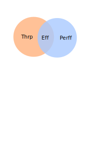

Indague y defina (con sus propias palabras) los siguientes conceptos. Acompañe sus definiciones con un diagrama de Venn.

1.  Eficiencia (_efficiency_). Sugerencia: aplique sus conocimientos del curso "Estructuras de datos y análisis de algoritmos".
    
2.  Desempeño (_throughput_).
    
3.  Rendimiento (_performance_).

Efficiency: Es la relación de trabajo logrado con el buen manjeo de los recursos, es decir que tan rápído y que tan bien utiliza los recursos para lograr una tarea.

Throughput: La cantidad de trabajo que se puede realizar o que tantos datos puede procesar

Performance: Que tan bien se puede realizar una tarea específica.

